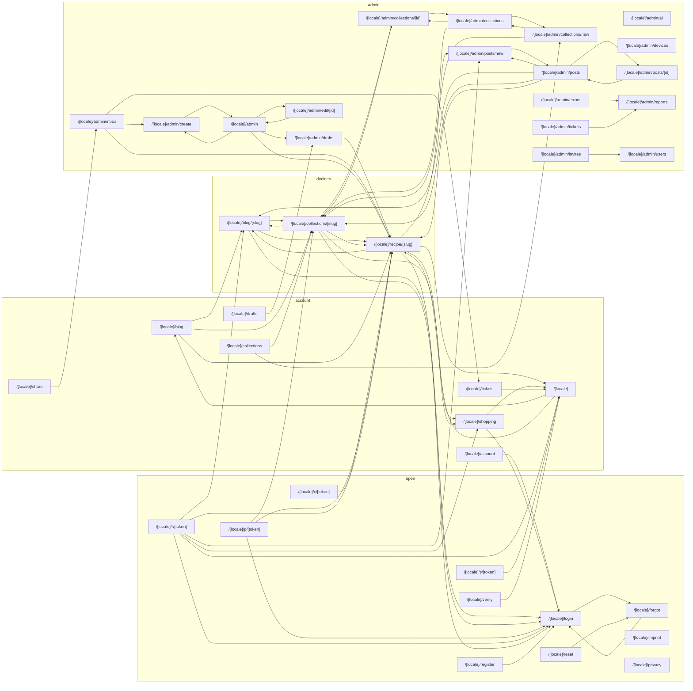

# Interaction map — generated

Read from the source by `scripts/interaction-map.ts`. Do not edit; run `npm run map`.
The analysis lives in [interaction-map.md](./interaction-map.md).

40 screens · 75 endpoints · 70 link edges · 76 call edges

## Screens

| Route | Access | Proxy | Calls | Links to |
|---|---|---|---|---|
| `/[locale]/account` | account | requires session | `* /api/account` `* /api/account/email` `* /api/account/name` `* /api/account/password` `* /api/auth/logout` `DELETE /api/account/avatar` `POST /api/account/avatar` | `/[locale]/login` |
| `/[locale]/admin/ai` | admin | requires admin | `DELETE /api/ai-keys/[id]` `DELETE /api/site-profiles/[id]` `GET /api/ai-keys` `GET /api/site-profiles` `PATCH /api/ai-keys` `POST /api/ai-keys` `POST /api/ai-keys/[id]/test` `POST /api/site-profiles` | — |
| `/[locale]/admin/collections/[id]` | admin | requires admin | `* /api/collections` `* /api/collections/[id]` `DELETE /api/collections/[id]` | `/[locale]/admin/collections` `/[locale]/collections/[id]` |
| `/[locale]/admin/collections/new` | admin | requires admin | `* /api/collections` `* /api/collections/[id]` `DELETE /api/collections/[id]` | `/[locale]/admin/collections` `/[locale]/collections/[id]` |
| `/[locale]/admin/collections` | admin | requires admin | `POST /api/examples` | `/[locale]/admin/collections/[id]` `/[locale]/admin/collections/new` `/[locale]/collections/[id]` |
| `/[locale]/admin/create` | admin | requires admin | `* /api/recipes` `* /api/recipes/[id]` `POST /api/ai/polish` `POST /api/import/ai` `POST /api/import/url` | `/[locale]/admin` |
| `/[locale]/admin/devices` | admin | requires admin | `DELETE /api/capture-tokens/[id]` `GET /api/capture-tokens` `POST /api/capture-tokens` | — |
| `/[locale]/admin/drafts` | admin | requires admin | `POST /api/recipes/[id]/draft` | `/[locale]/recipe/[id]` |
| `/[locale]/admin/edit/[id]` | admin | requires admin | `* /api/recipes` `* /api/recipes/[id]` `POST /api/ai/polish` `POST /api/import/ai` `POST /api/import/url` `POST /api/recipes/[id]/revisions/[id]` | `/[locale]/admin` |
| `/[locale]/admin/errors` | admin | requires admin | — | `/[locale]/admin/reports` |
| `/[locale]/admin/inbox` | admin | requires admin | `DELETE /api/capture/[id]` `GET /api/capture` `POST /api/capture/[id]` `POST /api/capture/[id]/merge` | `/[locale]/admin/create` `/[locale]/recipe/[id]` `/[locale]/tickets` |
| `/[locale]/admin/invites` | admin | requires admin | — | `/[locale]/admin/users` |
| `/[locale]/admin` | admin | requires admin | `* /api/collections/[id]/share` `* /api/collections/[id]/visibility` `* /api/posts/[id]/share` `* /api/posts/[id]/visibility` `* /api/recipes/[id]/share` `* /api/recipes/[id]/visibility` `DELETE /api/recipes/[id]` `GET /api/export` `POST /api/import/archive` `POST /api/import/recipes` | `/[locale]/admin/create` `/[locale]/admin/drafts` `/[locale]/admin/edit/[id]` `/[locale]/recipe/[id]` |
| `/[locale]/admin/posts/[id]` | admin | requires admin | `* /api/posts` `* /api/posts/[id]` | `/[locale]/admin/posts` |
| `/[locale]/admin/posts/new` | admin | requires admin | `* /api/posts` `* /api/posts/[id]` | `/[locale]/admin/posts` |
| `/[locale]/admin/posts` | admin | requires admin | `* /api/collections/[id]/share` `* /api/collections/[id]/visibility` `* /api/posts/[id]/share` `* /api/posts/[id]/visibility` `* /api/recipes/[id]/share` `* /api/recipes/[id]/visibility` `DELETE /api/posts/[id]` `POST /api/examples` | `/[locale]/admin/posts/[id]` `/[locale]/admin/posts/new` `/[locale]/blog/[id]` `/[locale]/collections/[id]` `/[locale]/recipe/[id]` |
| `/[locale]/admin/reports` | admin | requires admin | `DELETE /api/errors/[id]` `GET /api/errors` `GET /api/tickets` `PATCH /api/tickets` `POST /api/errors/[id]` | — |
| `/[locale]/admin/tickets` | admin | requires admin | — | `/[locale]/admin/reports` |
| `/[locale]/admin/users` | admin | requires admin | `DELETE /api/invites/[id]` `DELETE /api/users/[id]` `GET /api/invites` `GET /api/users` `PATCH /api/users/[id]/role` `POST /api/invites` | — |
| `/[locale]/blog/[slug]` | decides | steps aside | `* /api/collections/[id]/share` `* /api/collections/[id]/visibility` `* /api/posts/[id]/share` `* /api/posts/[id]/visibility` `* /api/recipes/[id]/share` `* /api/recipes/[id]/visibility` | `/[locale]/collections/[id]` `/[locale]/login` `/[locale]/recipe/[id]` |
| `/[locale]/blog` | account | requires session | `* /api/collections/[id]/share` `* /api/collections/[id]/visibility` `* /api/posts/[id]/share` `* /api/posts/[id]/visibility` `* /api/recipes/[id]/share` `* /api/recipes/[id]/visibility` | `/[locale]/blog/[id]` `/[locale]/collections/[id]` `/[locale]/recipe/[id]` |
| `/[locale]/c/[token]` | open | steps aside | — | `/[locale]/recipe/[id]` |
| `/[locale]/collections/[slug]` | decides | steps aside | `* /api/collections/[id]/share` `* /api/collections/[id]/visibility` `* /api/posts/[id]/share` `* /api/posts/[id]/visibility` `* /api/recipes/[id]/share` `* /api/recipes/[id]/visibility` `POST /api/shopping` | `/[locale]/admin/collections/[id]` `/[locale]/blog/[id]` `/[locale]/login` `/[locale]/recipe/[id]` `/[locale]/shopping` |
| `/[locale]/collections` | account | requires session | — | `/[locale]/admin/collections/new` `/[locale]/collections/[id]` |
| `/[locale]/drafts` | account | requires session | — | `/[locale]/admin/drafts` |
| `/[locale]/forgot` | open | steps aside | `POST /api/auth/forgot` | `/[locale]/login` |
| `/[locale]/imprint` | open | steps aside | — | — |
| `/[locale]/login` | open | steps aside | `POST /api/auth/login` | `/[locale]/forgot` |
| `/[locale]/p/[token]` | open | steps aside | `* /api/collections/[id]/share` `* /api/collections/[id]/visibility` `* /api/posts/[id]/share` `* /api/posts/[id]/visibility` `* /api/recipes/[id]/share` `* /api/recipes/[id]/visibility` | `/[locale]/collections/[id]` `/[locale]/login` `/[locale]/recipe/[id]` |
| `/[locale]` | account | requires session | `* /api/recipes/[id]/favorite` `GET /api/favorites` `POST /api/recipes/[id]/rate` | `/[locale]/blog` `/[locale]/recipe/[id]` |
| `/[locale]/privacy` | open | steps aside | — | — |
| `/[locale]/r/[token]` | open | steps aside | `* /api/collections/[id]/share` `* /api/collections/[id]/visibility` `* /api/posts/[id]/share` `* /api/posts/[id]/visibility` `* /api/recipes/[id]/favorite` `* /api/recipes/[id]/share` `* /api/recipes/[id]/visibility` `DELETE /api/recipes/[id]/cooked` `DELETE /api/recipes/[id]/cooked/photos` `PATCH /api/recipes/[id]/cooked` `POST /api/recipes/[id]/cooked` `POST /api/recipes/[id]/cooked/photos` `POST /api/recipes/[id]/rate` `POST /api/recipes/[id]/view` `POST /api/shopping` | `/[locale]` `/[locale]/admin/posts/new` `/[locale]/blog/[id]` `/[locale]/login` `/[locale]/recipe/[id]` `/[locale]/shopping` |
| `/[locale]/recipe/[slug]` | decides | steps aside | `* /api/collections/[id]/share` `* /api/collections/[id]/visibility` `* /api/posts/[id]/share` `* /api/posts/[id]/visibility` `* /api/recipes/[id]/favorite` `* /api/recipes/[id]/share` `* /api/recipes/[id]/visibility` `DELETE /api/recipes/[id]/cooked` `DELETE /api/recipes/[id]/cooked/photos` `PATCH /api/recipes/[id]/cooked` `POST /api/recipes/[id]/cooked` `POST /api/recipes/[id]/cooked/photos` `POST /api/recipes/[id]/draft` `POST /api/recipes/[id]/rate` `POST /api/recipes/[id]/view` `POST /api/shopping` | `/[locale]` `/[locale]/admin/posts/new` `/[locale]/blog/[id]` `/[locale]/login` `/[locale]/recipe/[id]` `/[locale]/shopping` |
| `/[locale]/register` | open | steps aside | `POST /api/auth/register` | `/[locale]/login` |
| `/[locale]/reset` | open | steps aside | `POST /api/auth/reset` | `/[locale]/forgot` |
| `/[locale]/s/[token]` | open | steps aside | `* /api/shopping` `* /api/shopping/share` `* /api/shopping/shared/[id]` `DELETE /api/shopping` `DELETE /api/shopping/[id]` `PATCH /api/shopping/[id]` | `/[locale]` |
| `/[locale]/share` | account | requires session | `POST /api/capture/share` | `/[locale]/admin/inbox` |
| `/[locale]/shopping` | account | requires session | `* /api/shopping` `* /api/shopping/share` `* /api/shopping/shared/[id]` `DELETE /api/shopping` `DELETE /api/shopping/[id]` `PATCH /api/shopping/[id]` | `/[locale]` `/[locale]/login` |
| `/[locale]/tickets` | account | requires session | `POST /api/tickets` | `/[locale]` |
| `/[locale]/verify` | open | steps aside | `POST /api/auth/verify` | `/[locale]` |

## Endpoints

| Method | Path | Gate | Validated | Rate-limited | Called from |
|---|---|---|---|---|---|
| POST | `/api/account/avatar` | user (manual) | — | yes | `account/AvatarForm` |
| DELETE | `/api/account/avatar` | user (manual) | — | yes | `account/AvatarForm` |
| POST | `/api/account/email` | user | zod | yes | `account/AccountSettings` |
| POST | `/api/account/name` | user | zod | — | `account/AccountSettings` |
| POST | `/api/account/password` | user | zod | yes | `account/AccountSettings` |
| DELETE | `/api/account` | user | zod | yes | `account/AccountSettings` |
| DELETE | `/api/ai-keys/[provider]` | admin | — | — | `admin/AiKeys` |
| POST | `/api/ai-keys/[provider]/test` | admin | — | yes | `admin/AiKeys` |
| GET | `/api/ai-keys` | admin | zod | — | `admin/AiKeys` |
| POST | `/api/ai-keys` | admin | zod | — | `admin/AiKeys` |
| PATCH | `/api/ai-keys` | admin | zod | — | `admin/AiKeys` |
| POST | `/api/ai/polish` | admin | zod | yes | `recipe-form/PolishPanel` |
| POST | `/api/auth/forgot` | none (open by design) | zod | yes | `src/app/[locale]/forgot/page.tsx` |
| POST | `/api/auth/login` | none (open by design) | zod | yes | `src/app/[locale]/login/page.tsx` |
| POST | `/api/auth/logout` | none (open by design) | — | — | `LogoutButton` `account/AccountSettings` |
| POST | `/api/auth/register` | none (open by design) | zod | yes | `auth/RegisterForm` |
| POST | `/api/auth/resend-verification` | user | zod | yes | `auth/ResendVerification` |
| POST | `/api/auth/reset` | device token | zod | yes | `auth/ResetForm` |
| POST | `/api/auth/verify` | device token | zod | yes | `src/app/[locale]/verify/page.tsx` |
| DELETE | `/api/capture-tokens/[id]` | admin | — | — | `src/app/[locale]/admin/devices/page.tsx` |
| GET | `/api/capture-tokens` | admin | zod | — | `src/app/[locale]/admin/devices/page.tsx` |
| POST | `/api/capture-tokens` | admin | zod | — | `src/app/[locale]/admin/devices/page.tsx` |
| POST | `/api/capture/[id]/merge` | admin | zod | — | `src/app/[locale]/admin/inbox/page.tsx` |
| POST | `/api/capture/[id]` | admin | zod | — | `src/app/[locale]/admin/inbox/page.tsx` |
| DELETE | `/api/capture/[id]` | admin | zod | — | `src/app/[locale]/admin/inbox/page.tsx` |
| POST | `/api/capture` | device token | zod | yes | *(nothing in the UI)* |
| GET | `/api/capture` | admin | zod | yes | `src/app/[locale]/admin/inbox/page.tsx` |
| PUT | `/api/collections/[id]` | admin | zod | — | `collection/CollectionForm` |
| DELETE | `/api/collections/[id]` | admin | zod | — | `collection/CollectionForm` |
| POST | `/api/collections/[id]/share` | admin | — | — | `share/ShareDialog` |
| DELETE | `/api/collections/[id]/share` | admin | — | — | `share/ShareDialog` |
| PATCH | `/api/collections/[id]/visibility` | admin | zod | — | `share/ShareDialog` |
| GET | `/api/collections` | user (manual) | zod | — | `collection/CollectionForm` |
| POST | `/api/collections` | admin | zod | — | `collection/CollectionForm` |
| GET | `/api/cron/backup` | cron secret | — | — | *(nothing in the UI)* |
| POST | `/api/errors/[id]` | admin | — | — | `admin/ErrorsPanel` |
| DELETE | `/api/errors/[id]` | admin | — | — | `admin/ErrorsPanel` |
| POST | `/api/errors` | none (open by design) | zod | yes | `ErrorReporter` `GlobalErrorReporter` |
| GET | `/api/errors` | admin | zod | yes | `admin/ErrorsPanel` |
| GET | `/api/export` | admin | — | — | `admin/BackupPanel` |
| POST | `/api/import/ai` | admin | zod | yes | `recipe-form/QuickImport` |
| POST | `/api/import/archive` | admin | — | — | `admin/BackupPanel` |
| POST | `/api/import/url` | admin | zod | yes | `recipe-form/QuickImport` |
| DELETE | `/api/invites/[id]` | admin | — | — | `admin/InvitationList` |
| GET | `/api/invites` | admin | zod | — | `admin/InvitationList` |
| POST | `/api/invites` | admin | zod | — | `admin/InvitationList` |
| PUT | `/api/posts/[id]` | admin | zod | — | `post/PostForm` |
| DELETE | `/api/posts/[id]` | admin | zod | — | `post/DeletePostButton` `post/PostForm` |
| POST | `/api/posts/[id]/share` | admin | — | — | `share/ShareDialog` |
| DELETE | `/api/posts/[id]/share` | admin | — | — | `share/ShareDialog` |
| PATCH | `/api/posts/[id]/visibility` | admin | zod | — | `share/ShareDialog` |
| POST | `/api/posts` | admin | zod | — | `post/PostForm` |
| POST | `/api/recipes/[id]/cooked/photos` | user (manual) | — | yes | `recipe/Cooked` |
| DELETE | `/api/recipes/[id]/cooked/photos` | user (manual) | — | yes | `recipe/Cooked` |
| POST | `/api/recipes/[id]/draft` | admin | — | — | `recipe/FinishDraft` |
| POST | `/api/recipes/[id]/favorite` | user | — | — | `FavoriteButton` |
| DELETE | `/api/recipes/[id]/favorite` | user | — | — | `FavoriteButton` |
| POST | `/api/recipes/[id]/rate` | user | zod | — | `Rating` |
| PUT | `/api/recipes/[id]` | admin | zod | — | `recipe-form/RecipeForm` |
| DELETE | `/api/recipes/[id]` | admin | zod | — | `DeleteRecipeButton` `recipe-form/RecipeForm` |
| POST | `/api/recipes/[id]/share` | admin | — | — | `share/ShareDialog` |
| DELETE | `/api/recipes/[id]/share` | admin | — | — | `share/ShareDialog` |
| POST | `/api/recipes/[id]/view` | user (manual) | — | yes | `ViewTracker` |
| PATCH | `/api/recipes/[id]/visibility` | admin | zod | — | `share/ShareDialog` |
| POST | `/api/recipes` | admin | zod | — | `recipe-form/RecipeForm` |
| DELETE | `/api/site-profiles/[host]` | admin | — | — | `admin/SiteProfiles` |
| GET | `/api/site-profiles` | admin | zod | yes | `admin/SiteProfiles` |
| POST | `/api/site-profiles` | admin | zod | yes | `admin/SiteProfiles` |
| POST | `/api/tickets` | user (manual) | zod | yes | `src/app/[locale]/tickets/page.tsx` |
| GET | `/api/tickets` | admin | zod | yes | `admin/TicketsPanel` |
| PATCH | `/api/tickets` | admin | zod | yes | `admin/TicketsPanel` |
| POST | `/api/upload` | admin | — | — | *(nothing in the UI)* |
| PATCH | `/api/users/[id]/role` | admin | zod | — | `admin/UserList` |
| DELETE | `/api/users/[id]` | admin | — | — | `admin/UserList` |
| GET | `/api/users` | admin | — | — | `admin/UserList` |

Calls the map could not match to an endpoint (a URL built elsewhere, or a path the regex misread):

- `* /api/shopping  (from shopping/ShoppingListView)`
- `* /api/shopping/share  (from shopping/ShoppingListView)`
- `* /api/shopping/shared/[id]  (from shopping/ShoppingListView)`
- `DELETE /api/recipes/[id]/cooked  (from recipe/Cooked)`
- `DELETE /api/shopping  (from shopping/ShoppingListView)`
- `DELETE /api/shopping/[id]  (from shopping/ShoppingListView)`
- `GET /api/favorites  (from home/OfflineFavorites)`
- `PATCH /api/recipes/[id]/cooked  (from recipe/Cooked)`
- `PATCH /api/shopping/[id]  (from shopping/ShoppingListView)`
- `POST /api/capture/share  (from admin/ShareIntoInbox)`
- `POST /api/examples  (from admin/ExampleButton)`
- `POST /api/import/recipes  (from admin/ForeignImport)`
- `POST /api/recipes/[id]/cooked  (from recipe/Cooked)`
- `POST /api/recipes/[id]/revisions/[id]  (from recipe-form/RecipeHistory)`
- `POST /api/shopping  (from shopping/AddToShopping)`

## Always present

Rendered by a layout rather than a page, so they are on every screen (or every admin screen) and are listed once rather than drawn as forty edges.

| Where | Component | Links to |
|---|---|---|
| Header | `Navbar` | `/[locale]` `/[locale]/account` `/[locale]/admin` `/[locale]/blog` `/[locale]/collections` `/[locale]/login` `/[locale]/shopping` |
| Footer | `Footer` | `/[locale]/imprint` `/[locale]/privacy` |
| Admin nav | `admin/AdminNav` | `/[locale]/admin` `/[locale]/admin/ai` `/[locale]/admin/collections` `/[locale]/admin/devices` `/[locale]/admin/drafts` `/[locale]/admin/inbox` `/[locale]/admin/posts` `/[locale]/admin/reports` `/[locale]/admin/users` |

## Navigation

Screen to screen, from every `href`, `router.push` and `redirect` in the page and the components it renders — the layouts' header, footer and admin nav excluded, since those are on every screen and are listed above.

## Who calls what

```mermaid
flowchart LR
  ePOST_api_account_avatar(["POST /api/account/avatar"])
  caccount_AvatarForm["account/AvatarForm"]
  caccount_AvatarForm --> ePOST_api_account_avatar
  eDELETE_api_account_avatar(["DELETE /api/account/avatar"])
  caccount_AvatarForm --> eDELETE_api_account_avatar
  ePOST_api_account_email(["POST /api/account/email"])
  caccount_AccountSettings["account/AccountSettings"]
  caccount_AccountSettings --> ePOST_api_account_email
  ePOST_api_account_name(["POST /api/account/name"])
  caccount_AccountSettings --> ePOST_api_account_name
  ePOST_api_account_password(["POST /api/account/password"])
  caccount_AccountSettings --> ePOST_api_account_password
  eDELETE_api_account(["DELETE /api/account"])
  caccount_AccountSettings --> eDELETE_api_account
  eDELETE_api_ai_keys__provider_(["DELETE /api/ai-keys/[provider]"])
  cadmin_AiKeys["admin/AiKeys"]
  cadmin_AiKeys --> eDELETE_api_ai_keys__provider_
  ePOST_api_ai_keys__provider__test(["POST /api/ai-keys/[provider]/test"])
  cadmin_AiKeys --> ePOST_api_ai_keys__provider__test
  eGET_api_ai_keys(["GET /api/ai-keys"])
  cadmin_AiKeys --> eGET_api_ai_keys
  ePOST_api_ai_keys(["POST /api/ai-keys"])
  cadmin_AiKeys --> ePOST_api_ai_keys
  ePATCH_api_ai_keys(["PATCH /api/ai-keys"])
  cadmin_AiKeys --> ePATCH_api_ai_keys
  ePOST_api_ai_polish(["POST /api/ai/polish"])
  crecipe_form_PolishPanel["recipe-form/PolishPanel"]
  crecipe_form_PolishPanel --> ePOST_api_ai_polish
  ePOST_api_auth_forgot(["POST /api/auth/forgot"])
  csrc_app__locale__forgot_page_tsx["src/app/[locale]/forgot/page.tsx"]
  csrc_app__locale__forgot_page_tsx --> ePOST_api_auth_forgot
  ePOST_api_auth_login(["POST /api/auth/login"])
  csrc_app__locale__login_page_tsx["src/app/[locale]/login/page.tsx"]
  csrc_app__locale__login_page_tsx --> ePOST_api_auth_login
  ePOST_api_auth_logout(["POST /api/auth/logout"])
  cLogoutButton["LogoutButton"]
  cLogoutButton --> ePOST_api_auth_logout
  caccount_AccountSettings --> ePOST_api_auth_logout
  ePOST_api_auth_register(["POST /api/auth/register"])
  cauth_RegisterForm["auth/RegisterForm"]
  cauth_RegisterForm --> ePOST_api_auth_register
  ePOST_api_auth_resend_verification(["POST /api/auth/resend-verification"])
  cauth_ResendVerification["auth/ResendVerification"]
  cauth_ResendVerification --> ePOST_api_auth_resend_verification
  ePOST_api_auth_reset(["POST /api/auth/reset"])
  cauth_ResetForm["auth/ResetForm"]
  cauth_ResetForm --> ePOST_api_auth_reset
  ePOST_api_auth_verify(["POST /api/auth/verify"])
  csrc_app__locale__verify_page_tsx["src/app/[locale]/verify/page.tsx"]
  csrc_app__locale__verify_page_tsx --> ePOST_api_auth_verify
  eDELETE_api_capture_tokens__id_(["DELETE /api/capture-tokens/[id]"])
  csrc_app__locale__admin_devices_page_tsx["src/app/[locale]/admin/devices/page.tsx"]
  csrc_app__locale__admin_devices_page_tsx --> eDELETE_api_capture_tokens__id_
  eGET_api_capture_tokens(["GET /api/capture-tokens"])
  csrc_app__locale__admin_devices_page_tsx --> eGET_api_capture_tokens
  ePOST_api_capture_tokens(["POST /api/capture-tokens"])
  csrc_app__locale__admin_devices_page_tsx --> ePOST_api_capture_tokens
  ePOST_api_capture__id__merge(["POST /api/capture/[id]/merge"])
  csrc_app__locale__admin_inbox_page_tsx["src/app/[locale]/admin/inbox/page.tsx"]
  csrc_app__locale__admin_inbox_page_tsx --> ePOST_api_capture__id__merge
  ePOST_api_capture__id_(["POST /api/capture/[id]"])
  csrc_app__locale__admin_inbox_page_tsx --> ePOST_api_capture__id_
  eDELETE_api_capture__id_(["DELETE /api/capture/[id]"])
  csrc_app__locale__admin_inbox_page_tsx --> eDELETE_api_capture__id_
  eGET_api_capture(["GET /api/capture"])
  csrc_app__locale__admin_inbox_page_tsx --> eGET_api_capture
  ePUT_api_collections__id_(["PUT /api/collections/[id]"])
  ccollection_CollectionForm["collection/CollectionForm"]
  ccollection_CollectionForm --> ePUT_api_collections__id_
  eDELETE_api_collections__id_(["DELETE /api/collections/[id]"])
  ccollection_CollectionForm --> eDELETE_api_collections__id_
  ePOST_api_collections__id__share(["POST /api/collections/[id]/share"])
  cshare_ShareDialog["share/ShareDialog"]
  cshare_ShareDialog --> ePOST_api_collections__id__share
  eDELETE_api_collections__id__share(["DELETE /api/collections/[id]/share"])
  cshare_ShareDialog --> eDELETE_api_collections__id__share
  ePATCH_api_collections__id__visibility(["PATCH /api/collections/[id]/visibility"])
  cshare_ShareDialog --> ePATCH_api_collections__id__visibility
  eGET_api_collections(["GET /api/collections"])
  ccollection_CollectionForm --> eGET_api_collections
  ePOST_api_collections(["POST /api/collections"])
  ccollection_CollectionForm --> ePOST_api_collections
  ePOST_api_errors__id_(["POST /api/errors/[id]"])
  cadmin_ErrorsPanel["admin/ErrorsPanel"]
  cadmin_ErrorsPanel --> ePOST_api_errors__id_
  eDELETE_api_errors__id_(["DELETE /api/errors/[id]"])
  cadmin_ErrorsPanel --> eDELETE_api_errors__id_
  ePOST_api_errors(["POST /api/errors"])
  cErrorReporter["ErrorReporter"]
  cErrorReporter --> ePOST_api_errors
  cGlobalErrorReporter["GlobalErrorReporter"]
  cGlobalErrorReporter --> ePOST_api_errors
  eGET_api_errors(["GET /api/errors"])
  cadmin_ErrorsPanel --> eGET_api_errors
  eGET_api_export(["GET /api/export"])
  cadmin_BackupPanel["admin/BackupPanel"]
  cadmin_BackupPanel --> eGET_api_export
  ePOST_api_import_ai(["POST /api/import/ai"])
  crecipe_form_QuickImport["recipe-form/QuickImport"]
  crecipe_form_QuickImport --> ePOST_api_import_ai
  ePOST_api_import_archive(["POST /api/import/archive"])
  cadmin_BackupPanel --> ePOST_api_import_archive
  ePOST_api_import_url(["POST /api/import/url"])
  crecipe_form_QuickImport --> ePOST_api_import_url
  eDELETE_api_invites__id_(["DELETE /api/invites/[id]"])
  cadmin_InvitationList["admin/InvitationList"]
  cadmin_InvitationList --> eDELETE_api_invites__id_
  eGET_api_invites(["GET /api/invites"])
  cadmin_InvitationList --> eGET_api_invites
  ePOST_api_invites(["POST /api/invites"])
  cadmin_InvitationList --> ePOST_api_invites
  ePUT_api_posts__id_(["PUT /api/posts/[id]"])
  cpost_PostForm["post/PostForm"]
  cpost_PostForm --> ePUT_api_posts__id_
  eDELETE_api_posts__id_(["DELETE /api/posts/[id]"])
  cpost_DeletePostButton["post/DeletePostButton"]
  cpost_DeletePostButton --> eDELETE_api_posts__id_
  cpost_PostForm --> eDELETE_api_posts__id_
  ePOST_api_posts__id__share(["POST /api/posts/[id]/share"])
  cshare_ShareDialog --> ePOST_api_posts__id__share
  eDELETE_api_posts__id__share(["DELETE /api/posts/[id]/share"])
  cshare_ShareDialog --> eDELETE_api_posts__id__share
  ePATCH_api_posts__id__visibility(["PATCH /api/posts/[id]/visibility"])
  cshare_ShareDialog --> ePATCH_api_posts__id__visibility
  ePOST_api_posts(["POST /api/posts"])
  cpost_PostForm --> ePOST_api_posts
  ePOST_api_recipes__id__cooked_photos(["POST /api/recipes/[id]/cooked/photos"])
  crecipe_Cooked["recipe/Cooked"]
  crecipe_Cooked --> ePOST_api_recipes__id__cooked_photos
  eDELETE_api_recipes__id__cooked_photos(["DELETE /api/recipes/[id]/cooked/photos"])
  crecipe_Cooked --> eDELETE_api_recipes__id__cooked_photos
  ePOST_api_recipes__id__draft(["POST /api/recipes/[id]/draft"])
  crecipe_FinishDraft["recipe/FinishDraft"]
  crecipe_FinishDraft --> ePOST_api_recipes__id__draft
  ePOST_api_recipes__id__favorite(["POST /api/recipes/[id]/favorite"])
  cFavoriteButton["FavoriteButton"]
  cFavoriteButton --> ePOST_api_recipes__id__favorite
  eDELETE_api_recipes__id__favorite(["DELETE /api/recipes/[id]/favorite"])
  cFavoriteButton --> eDELETE_api_recipes__id__favorite
  ePOST_api_recipes__id__rate(["POST /api/recipes/[id]/rate"])
  cRating["Rating"]
  cRating --> ePOST_api_recipes__id__rate
  ePUT_api_recipes__id_(["PUT /api/recipes/[id]"])
  crecipe_form_RecipeForm["recipe-form/RecipeForm"]
  crecipe_form_RecipeForm --> ePUT_api_recipes__id_
  eDELETE_api_recipes__id_(["DELETE /api/recipes/[id]"])
  cDeleteRecipeButton["DeleteRecipeButton"]
  cDeleteRecipeButton --> eDELETE_api_recipes__id_
  crecipe_form_RecipeForm --> eDELETE_api_recipes__id_
  ePOST_api_recipes__id__share(["POST /api/recipes/[id]/share"])
  cshare_ShareDialog --> ePOST_api_recipes__id__share
  eDELETE_api_recipes__id__share(["DELETE /api/recipes/[id]/share"])
  cshare_ShareDialog --> eDELETE_api_recipes__id__share
  ePOST_api_recipes__id__view(["POST /api/recipes/[id]/view"])
  cViewTracker["ViewTracker"]
  cViewTracker --> ePOST_api_recipes__id__view
  ePATCH_api_recipes__id__visibility(["PATCH /api/recipes/[id]/visibility"])
  cshare_ShareDialog --> ePATCH_api_recipes__id__visibility
  ePOST_api_recipes(["POST /api/recipes"])
  crecipe_form_RecipeForm --> ePOST_api_recipes
  eDELETE_api_site_profiles__host_(["DELETE /api/site-profiles/[host]"])
  cadmin_SiteProfiles["admin/SiteProfiles"]
  cadmin_SiteProfiles --> eDELETE_api_site_profiles__host_
  eGET_api_site_profiles(["GET /api/site-profiles"])
  cadmin_SiteProfiles --> eGET_api_site_profiles
  ePOST_api_site_profiles(["POST /api/site-profiles"])
  cadmin_SiteProfiles --> ePOST_api_site_profiles
  ePOST_api_tickets(["POST /api/tickets"])
  csrc_app__locale__tickets_page_tsx["src/app/[locale]/tickets/page.tsx"]
  csrc_app__locale__tickets_page_tsx --> ePOST_api_tickets
  eGET_api_tickets(["GET /api/tickets"])
  cadmin_TicketsPanel["admin/TicketsPanel"]
  cadmin_TicketsPanel --> eGET_api_tickets
  ePATCH_api_tickets(["PATCH /api/tickets"])
  cadmin_TicketsPanel --> ePATCH_api_tickets
  ePATCH_api_users__id__role(["PATCH /api/users/[id]/role"])
  cadmin_UserList["admin/UserList"]
  cadmin_UserList --> ePATCH_api_users__id__role
  eDELETE_api_users__id_(["DELETE /api/users/[id]"])
  cadmin_UserList --> eDELETE_api_users__id_
  eGET_api_users(["GET /api/users"])
  cadmin_UserList --> eGET_api_users
```

